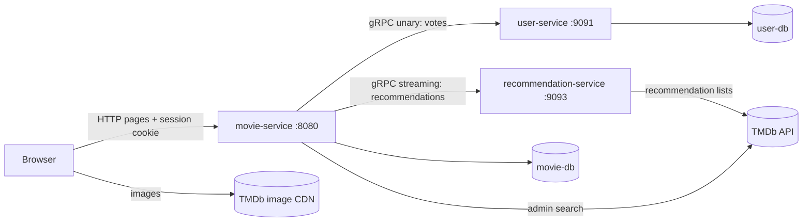

# gRPC Movie Platform

A **proof-of-concept** microservices system built around **gRPC
inter-service communication**: a Thymeleaf server-rendered web app with Spring Security
session auth (`movie-service`), a gRPC votes store (`user-service`), and a stateless
TMDb-backed recommendation aggregator (`recommendation-service`). 

---

## Recommended Development Stack

| Tech Component     | Target Version                |
|:-------------------|:------------------------------|
| **Java JDK**       | **Java 25** (Eclipse Temurin) |
| **Build Tool**     | **Maven 3.9.x**               |
| **Docker Engine**  | **Docker 29.x**               |
| **Docker Compose** | **Docker Compose 2.20.x**     |

---

## Service Architecture



**Port map:** `movie-service` 8080 (web + REST), `user-service` gRPC 9091 (HTTP 8081
for actuator), `recommendation-service` gRPC 9093 (HTTP 8083 for actuator), PostgreSQL
5432 (dev binds it to `127.0.0.1` only; the containerized "compose" keeps it internal
to the Docker network).

| Tier            | Components                         | Role                                                                                    |
|:----------------|:-----------------------------------|:----------------------------------------------------------------------------------------|
| Web / BFF       | `movie-service`                    | Thymeleaf SSR + session auth + catalog REST + gRPC client to both inner services        |
| Votes           | `user-service`                     | gRPC server owning like/dislike rows in `user-db`                                       |
| Recommendations | `recommendation-service`           | Stateless gRPC server wrapping the TMDb API                                             |
| Contract        | `proto-contract`                   | Build-time library: shared `.proto` files and generated stubs (never a running process) |
| Data            | PostgreSQL (`movie-db`, `user-db`) | All persistence                                                                         |


---

```text
/grpc-movie-platform/
  ├── pom.xml                (parent POM: spring-boot-starter-parent 4.x)
  ├── docker-compose.dev.yml (local infrastructure: PostgreSQL only)
  ├── docker-compose.yml     (full deployment: PostgreSQL + all three services)
  ├── Dockerfile             (multi-stage build for the three services, used by docker-compose.yml)
  ├── .dockerignore          (keeps .env, target/, git state out of image contexts)
  ├── docker/postgres/init/  (bootstrap: 01-create-databases.sql)
  ├── proto-contract/        (shared .proto files + generated gRPC stubs)
  ├── movie-service/         (web + auth + catalog + gRPC client, port 8080)
  ├── user-service/          (gRPC votes store, port 9091)
  └── recommendation-service/ (stateless TMDb adapter, gRPC 9093)
```

---

## Infrastructure & run instructions

Two compose files cover the two operating modes; both read the same `.env`. Note
that only `docker compose` reads `.env` — services started by hand with
`mvn spring-boot:run` need it exported into their shell.

| File                     | Mode                     | What runs where                                                                                                                                                                                                                                                                                                                                             |
|:-------------------------|:-------------------------|:------------------------------------------------------------------------------------------------------------------------------------------------------------------------------------------------------------------------------------------------------------------------------------------------------------------------------------------------------------|
| `docker-compose.dev.yml` | Local development        | PostgreSQL 17 container only, bound to `127.0.0.1:5432`; the three Spring services run on the host from Maven/IntelliJ.                                                                                                                                                                                                                                     |
| `docker-compose.yml`     | Containerized deployment | Everything in containers: PostgreSQL + all three Spring services, image-built from this repo, wired over one internal Docker network; only `movie-service` is published to the host (`${MOVIE_SERVICE_PORT:-8080}`). PostgreSQL, the gRPC ports and the actuator ports stay internal to the network. The postgres data volume is separate from the dev one. |

### Local development

1. `cp .env.example .env` — set `TMDB_ACCESS_TOKEN` and the Postgres password.
2. `docker compose -f docker-compose.dev.yml up -d --wait`
3. `mvn -B verify`
4. Load `.env` once per terminal: `set -a; source .env; set +a`
5. Run the three services (any order), each in a terminal with `.env` loaded:

   ```bash
   set -a; source .env; set +a; mvn -pl user-service spring-boot:run
   set -a; source .env; set +a; mvn -pl recommendation-service spring-boot:run
   set -a; source .env; set +a; mvn -pl movie-service spring-boot:run
   ```

6. Open `http://localhost:8080` — fixtures: `admin` / `change-me-admin`, `user` / `change-me-user`.
7. Tear down: `docker compose -f docker-compose.dev.yml down -v`

### Containerized

1. `cp .env.example .env` — set `TMDB_ACCESS_TOKEN` and the Postgres password.
2. `docker compose up -d --build --wait`
3. Open `http://localhost:8080`
4. Tear down: `docker compose down -v`

